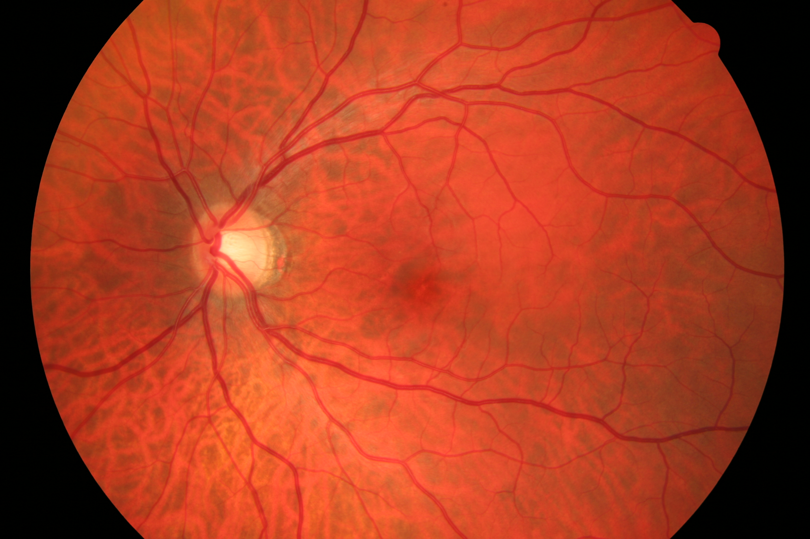

# Cataract detection using ML (01/2020 - 03/2020)
  1. Used OpenCV, Keras, image processing and python concepts. 
  2. Created a software that helps to detect the Cataract disease from the fundus images

#### • Cataract

 

#### • Normal

 

